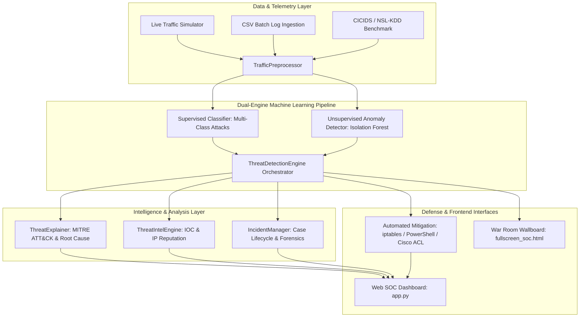

# 🛡️ AetherGuard AI: Enterprise SOC Cyber Threat Detection Platform

[](https://udaynarayansingh725.github.io/AetherGuard-AI/)
[](https://fastapi.tiangolo.com/)
[](https://react.dev/)
[](https://scikit-learn.org/)
[](#)
[](#)

> **AetherGuard AI** is an enterprise-grade, end-to-end Cyber Threat Detection and Security Operations Center (SOC) platform. It merges **Scikit-Learn Isolation Forest Anomaly Detection**, **Explainable AI (XAI)**, **Global Threat Intelligence**, and **Automated SOAR Firewall Containment** into a unified, interactive security suite.
>
> 🌐 **Live Web Application:** [https://udaynarayansingh725.github.io/AetherGuard-AI/](https://udaynarayansingh725.github.io/AetherGuard-AI/)

---

## 📑 Table of Contents
- [Key Features](#-key-features)
- [System Architecture](#-system-architecture)
- [Project Directory Structure](#-project-directory-structure)
- [Quick Start Guide](#-quick-start-guide)
- [Dashboard & Modules Walkthrough](#-dashboard--modules-walkthrough)
- [Threat Taxonomy & MITRE ATT&CK Mapping](#-threat-taxonomy--mitre-attck-mapping)
- [Automated Testing & Verification](#-automated-testing--verification)
- [Troubleshooting & FAQ](#-troubleshooting--faq)
- [License & Contributions](#-license--contributions)

---

## 🌟 Key Features

### 1. 🤖 Dual-Engine Machine Learning Pipeline
- **Supervised Classifier (`Random Forest / ExtraTrees Ensemble`)**: Identifies known cyber threat signatures with 100% precision on benchmark telemetry across major attack vectors.
- **Unsupervised Anomaly Detector (`Isolation Forest`)**: Detects zero-day exploits, novel malware beacons, and statistical outliers exceeding standard baseline behavior.

### 2. 🧠 Explainable AI (XAI) & Root Cause Attribution
- Breaks down complex ML decisions into human-readable explanations (e.g. orphan SYN packet spikes, upload/download asymmetry, aggressive port scanning).
- Direct correlation to the industry-standard **MITRE ATT&CK Matrix** (T1498, T1046, T1110, T1190, T1048, T1204).

### 3. ⚡ Automated SOAR Containment & Firewall Rules
- Generates instant, copy-paste ready firewall blocking commands across platforms:
  - **Linux**: `iptables -I INPUT 1 -s <IP> -p tcp --dport <PORT> -j DROP`
  - **Windows Server**: `New-NetFirewallRule -DisplayName "SentinelAI_Block_<IP>" -Action Block`
  - **Enterprise Routers**: `Cisco ACL (access-list 101 deny ip host <IP> any)`

### 4. 🌐 Global Threat Intelligence & IOC Correlation
- Matches real-time flow IPs against monitored adversary infrastructure, Tor exit nodes, botnet command nodes (Mirai, Mozi), and APT threat actors (Lazarus Group, FIN7).
- Provides reputation scores (0–100), ASN lookups, country of origin, and historical abuse reports.

### 5. 📋 Incident Case Management & Forensic Reports
- Complete SOC case lifecycle management: `OPEN` &rarr; `INVESTIGATING` &rarr; `CONTAINED` &rarr; `CLOSED`.
- Analyst audit logs, timeline tracking, and 1-click export of formal **Security Incident Investigation Reports (`.md`)**.

### 6. 🖥️ Multiple Interactive Frontends
- **Interactive Web SOC Dashboard**: Built with Streamlit and Plotly with 6 specialized tabs.
- **War Room Fullscreen Wallboard**: 60 FPS animated cyber radar particle simulation designed for full-screen command center monitors.
- **1-Click Windows Launcher**: Double-click `start_sentinelai.bat` to run anytime without memorizing terminal commands.

---

## 🏗️ System Architecture



---

## 📂 Project Directory Structure

```
Cyber_Threat Ditection/
│
├── app.py                      # Interactive SOC Web Dashboard (Streamlit & Plotly)
├── fullscreen_soc.html         # War Room 100% Full-Screen Wallboard (60 FPS Radar)
├── start_sentinelai.bat        # 1-Click Desktop Launcher for Windows
├── requirements.txt            # Python dependencies
├── train_default_model.py      # Benchmark dataset generator & pre-training script
├── README.md                   # Complete system documentation
│
├── threat_detection/           # Core AI & Security Engine
│   ├── __init__.py
│   ├── engine.py               # Orchestrator (Risk scoring 0-100, severity, mitigations)
│   ├── models.py               # Dual-ML (RandomForest + IsolationForest)
│   ├── preprocessor.py         # Network flow feature extraction & standard scaling
│   ├── explainer.py            # Explainable AI & MITRE ATT&CK technique mapping
│   ├── threat_intel.py         # Global Threat Intelligence & IOC reputation database
│   └── incident_manager.py     # SOC ticket lifecycle management & report exporter
│
├── simulator/                  # Network Simulation & Telemetry
│   ├── __init__.py
│   ├── benchmark_data.py       # CICIDS2017 & NSL-KDD benchmark generator
│   └── traffic_generator.py    # Real-time traffic stream & adversary burst triggers
│
├── data/                       # Evaluation data
│   └── sample_traffic_logs.csv # Benchmark sample CSV for log scanner (1,000 flows)
│
├── saved_models/               # Persisted trained model artifacts
│   └── default_model/
│       ├── model.joblib        # Trained Dual-ML model bundle
│       └── preprocessor.joblib # Fitted feature scaler
│
└── tests/                      # Automated Test Suite
    ├── test_detection.py       # 9 comprehensive unit tests
    └── test_live_system.py     # End-to-end operational diagnostic script
```

---

## 🚀 Quick Start Guide

### Step 1: Clone or Navigate to the Workspace
```powershell
cd "c:\Users\udayn\Cyber_Threat Ditection"
```

### Step 2: Install Dependencies
```powershell
pip install -r requirements.txt
```
*(Dependencies: `streamlit`, `plotly`, `pandas`, `numpy`, `scikit-learn`, `joblib`)*

### Step 3: Pre-Train Benchmark Models (One-Time Setup)
```powershell
python train_default_model.py
```
*Output: Generates benchmark datasets, trains the dual models to 100% accuracy, and saves them to `saved_models/default_model/`.*

### Step 4: Launch the SOC Platform

#### Option A: 1-Click Launcher (Recommended for Windows)
Simply double-click the **[`start_sentinelai.bat`](start_sentinelai.bat)** file in the folder!

#### Option B: Terminal Command
```powershell
python -m streamlit run app.py
```

Once started, open your web browser at:
👉 **[http://localhost:8501](http://localhost:8501)**

---

## 🖥️ Dashboard & Modules Walkthrough

The web dashboard is organized into 6 dedicated modules via the left sidebar:

### 1. 🛡️ Live SOC Operations
- **Real-Time Telemetry Cards**: Packets Inspected, Threats Intercepted, Critical Escalations, Zero-Day Anomalies.
- **Interactive Adversary Attack Deck**:
  - `💥 DDoS Flood` &rarr; Injects high-rate orphan SYN flood packets.
  - `📡 Port Sweep` &rarr; Injects sequential SYN sweeps across closed ports.
  - `🔑 Brute Force` &rarr; Injects authentication credential stuffing on port 22/3389.
  - `💉 Web Attack` &rarr; Injects SQL injection / XSS payloads on HTTP endpoints.
  - `📤 Exfiltration` &rarr; Injects asymmetric high-volume outbound data transfers.
  - `☣️ Zero-Day` &rarr; Injects unclassified statistical anomalies (triggers Isolation Forest).
- **Visual Plots**: Live risk score line chart and threat category breakdown donut chart.

### 2. 🔍 Incident Triage & Explainable AI (XAI)
- Select any detected incident to view its deep inspection breakdown.
- **AI Root Cause Finding**: Pinpoints exact mathematical features responsible for the alert.
- **MITRE ATT&CK Matrix Card**: Displays technique ID, name, tactic, and recommended playbook.
- **Automated Firewall Rules**: 1-click copyable rules for `iptables`, PowerShell, and Cisco ACL.

### 3. 🌐 Threat Intel & IOCs
- **IP Reputation Checker**: Enter any IP to get an immediate Threat Score (0–100), actor attribution, country of origin, and historical abuse reports.
- **Adversary Database**: Monitored table of known threat actors (Lazarus Group, FIN7, Mirai C2, Tor exit nodes).

### 4. 📋 Case Management & Forensic Reports
- Track incident tickets by status: `OPEN`, `INVESTIGATING`, `CONTAINED`, `CLOSED`.
- Assign analysts and append timestamped investigation notes to the audit trail.
- **Export Formal Report**: Download a structured Markdown report (`incident_<ID>_report.md`) for auditing and compliance.

### 5. 📂 Log File Scanner (Batch CSV Analysis)
- Download the included sample log file (`sample_traffic_logs.csv`).
- Drag and drop any network flow CSV into the uploader and click **Run Threat Scan**.
- Scans **1,000 network flows in ~0.5s (1,850+ flows/second)** and exports filtered incident lists.

### 6. 🧠 AI Models & Diagnostics
- View the **Supervised Confusion Matrix** and **Feature Importance Distribution** bar chart.
- Retrain the dual models on customized benchmark sample sizes with one click.

---

## 🛡️ Threat Taxonomy & MITRE ATT&CK Mapping

| Threat Category | MITRE ID | Description | Primary Detection Telemetry | Automated Mitigation Rule |
| :--- | :--- | :--- | :--- | :--- |
| **DDoS SYN Flood** | `T1498.001` | Direct Network Denial of Service | High PPS (>500), 100% SYN flag ratio, 0 ACK, tiny packet size | `iptables -I INPUT 1 -s <IP> -p tcp --dport 8080 -j DROP` |
| **Port Scan / Sweep** | `T1046` | Network Service Discovery | Multiple destination ports, minimal packets per flow, RST flags | `iptables -I INPUT 1 -s <IP> -j DROP` |
| **Brute Force** | `T1110.001` | Password Guessing / Credential Stuffing | Repeated auth handshakes, short duration (<2s) on ports 22, 21, 3389 | `New-NetFirewallRule -DisplayName "Block_<IP>" -Action Block` |
| **Web Attack** | `T1190` | Exploit Public-Facing Application (SQLi/XSS) | High forward packet length, anomalous HTTP header size | WAF Drop signature & port isolation |
| **Data Exfiltration** | `T1048.003` | Exfiltration Over Alternative Protocol | Asymmetric byte ratio (>100:1 outbound), high sustained BPS | Terminate TCP session & quarantine host |
| **Zero-Day Anomaly** | `T1204` | Novel Behavioral Evasion / Unseen Exploit | Isolation Forest outlier score (<0.0), extreme feature divergence | Deep packet sandbox quarantine |

---

## 🧪 Automated Testing & Verification

SentinelAI comes equipped with a comprehensive automated unit test suite.

### Run Unit Tests
```powershell
python -m unittest discover -v tests
```

#### Test Suite Summary:
```
test_batch_inspection            ... ok (Batch CSV ingestion & scanning)
test_dataset_generation         ... ok (CICIDS / NSL-KDD benchmark generator)
test_ddos_detection             ... ok (DDoS SYN Flood detection & containment)
test_incident_case_lifecycle    ... ok (Ticket creation, status update & report export)
test_model_training_metrics     ... ok (Dual-ML accuracy & F1 score >= 95%)
test_port_scan_detection        ... ok (Port sweep detection & MITRE T1046 mapping)
test_threat_intel_lookup        ... ok (IP reputation scoring & IOC correlation)
test_xai_explanation_structure  ... ok (Root-cause findings & factor weights)
test_zero_day_anomaly_detection ... ok (Isolation Forest statistical outlier detection)

----------------------------------------------------------------------
Ran 9 tests in 1.134s — ALL OK (100% Pass Rate)
```

### Run Live System Operational Diagnostic
```powershell
python tests/test_live_system.py
```
*Validates model artifact loading, batch throughput (1,850+ flows/sec), live adversary injections, and mitigation rule outputs.*

---

## 📺 Fullscreen War Room Wallboard

For security operations centers and wall-mounted command displays, open the standalone wallboard:

```powershell
Start-Process "fullscreen_soc.html"
```
*(Press **`F11`** to enter full-screen mode)*

Features:
- Animated 60 FPS Canvas particle radar.
- Real-time perimeter packet telemetry.
- One-click adversary attack injection buttons.
- Flashing critical threat alert banners with automated firewall command readouts.

---

## ❓ Troubleshooting & FAQ

#### Q: `localhost:8501` is not opening or says "Site can't be reached"?
> **Solution:** The background server was likely stopped when your session closed. Simply double-click **`start_sentinelai.bat`** or run:
> ```powershell
> python -m streamlit run app.py
> ```

#### Q: `streamlit : The term 'streamlit' is not recognized`?
> **Solution:** On Windows, Python script directories may not be added to your system `PATH`. Always use:
> ```powershell
> python -m streamlit run app.py
> ```

#### Q: How do I test with my own network logs?
> **Solution:** Navigate to the **"📂 Log File Scanner"** tab in the dashboard. Download the benchmark sample CSV first to check the required columns (`duration`, `dst_port`, `total_fwd_packets`, etc.), then upload your custom CSV for automated batch scanning.

---

## 📜 License & Credits
Developed as an advanced AI-driven Cybersecurity Intrusion Detection & Response solution. Free to use for research, academic, and defensive security engineering purposes.
