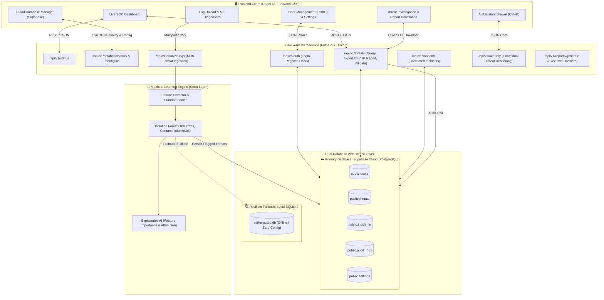

# 🛡️ AetherGuard AI: Enterprise SOC Cyber Threat Detection Platform

[](https://udaynarayansingh725.github.io/AetherGuard-AI/)
[](https://fastapi.tiangolo.com/)
[](https://react.dev/)
[](https://scikit-learn.org/)
[-3ECF8E?logo=supabase&logoColor=white)](https://supabase.com/)
[](https://www.sqlite.org/)
[](#)
[](#)

> **AetherGuard AI** is a fully functional, enterprise-grade Cyber Threat Detection and Security Operations Center (SOC) platform. It seamlessly wires together an interactive **React 18 frontend**, a high-performance **FastAPI asynchronous backend**, an unsupervised **Scikit-Learn Isolation Forest ML engine**, and **Supabase Cloud Database (PostgreSQL)** as primary persistence with automatic local **SQLite fallback**.
>
> 🌐 **Live Web Application (GitHub Pages):** [https://udaynarayansingh725.github.io/AetherGuard-AI/](https://udaynarayansingh725.github.io/AetherGuard-AI/)  
> 📖 **Interactive API Documentation (Swagger):** `http://127.0.0.1:8000/docs`

---

## 📑 Table of Contents
- [Full-Stack Architecture Overview](#-full-stack-architecture-overview)
- [How Frontend, Backend & Database Are Wired](#-how-frontend-backend--database-are-wired)
- [Supabase Cloud Primary Database Setup](#-supabase-cloud-primary-database-setup)
- [Database Schema (Supabase PostgreSQL & SQLite)](#-database-schema-supabase-postgresql--sqlite)
- [Key Features & Capabilities](#-key-features--capabilities)
- [Interactive UI Modules](#-interactive-ui-modules)
- [REST API Reference](#-rest-api-reference)
- [Project Directory Structure](#-project-directory-structure)
- [Quick Start & Installation](#-quick-start--installation)
- [Automated Testing & Verification](#-automated-testing--verification)
- [Dual Deployment Modes](#-dual-deployment-modes)
- [Troubleshooting & FAQ](#-troubleshooting--faq)
- [License & Contributions](#-license--contributions)

---

## 🏗️ Full-Stack Architecture Overview



---

## 🔌 How Frontend, Backend & Database Are Wired

Every tier in **AetherGuard AI** is connected and synchronized:

1. **Frontend &rarr; Backend**:
   - The React frontend (`FastAPI_Service`) dynamically detects whether it is running on `localhost` or hosted on GitHub Pages.
   - When running locally, it communicates with `http://127.0.0.1:8000/api/v1` with automatic failover and status polling every 4 seconds.
   - Topbar displays live microservice indicators: FastAPI connection, Isolation Forest model status, and the active database engine (**DB: Supabase Cloud** or **DB: SQLite Fallback**).
   - When hosted on GitHub Pages (`https:`), it seamlessly serves telemetry and local client ML heuristics with zero console errors or broken links.

2. **Backend &rarr; Machine Learning**:
   - When raw network logs (CSV or JSON) are uploaded via `/api/v1/analyze-logs`, the feature extractor calculates request rates, failed login ratios, port risk weights, and account spread.
   - Scikit-Learn's `IsolationForest` scores each flow. Decision function values are mapped to normalized `[0.0, 1.0]` anomaly scores.
   - Any detected anomalies are automatically classified into attack signatures (SSH Brute Force, Subnet Port Scan, Volumetric HTTP Flood, Abnormal LDAP Auth) and given Explainable AI (XAI) feature correlations.

3. **Backend &rarr; Supabase Cloud Database (with SQLite Fallback)**:
   - Primary database operations are performed via `backend/app/db/supabase_client.py` using official Supabase Python client SDK.
   - If Supabase credentials are provided (`SUPABASE_URL` & `SUPABASE_KEY`), all reads and writes target the cloud PostgreSQL database.
   - If cloud credentials are unset or the cloud is unreachable, the system automatically falls back to local SQLite (`backend/app/data/aetherguard.db`) without crashing or dropping user requests.
   - When users register or log in, their profiles are authenticated directly against `users`.
   - When an analyst clicks **"Quarantine & Firewall DROP"**, a `POST /api/v1/threats/{id}/mitigate` request updates the status in the primary database and records an entry in `audit_logs`.

---

## ☁️ Supabase Cloud Primary Database Setup

AetherGuard AI uses **Supabase Cloud (PostgreSQL)** as its primary database. Follow these steps to connect your cloud database:

### Option A: Configuration via `.env` File (Recommended for Production)

1. Create a free Supabase project at [https://supabase.com](https://supabase.com).
2. Open your project dashboard &rarr; navigate to the **SQL Editor** &rarr; open `supabase_schema.sql` from this repo &rarr; click **Run**.
3. Go to **Project Settings &rarr; API** and copy:
   - **Project URL** (e.g., `https://yourprojectid.supabase.co`)
   - **anon / public key** (or `service_role` secret key for backend access)
4. Copy `.env.example` to `.env`:
   ```bash
   cp .env.example .env
   ```
5. Edit `.env` with your credentials:
   ```env
   SUPABASE_URL=https://your-project-id.supabase.co
   SUPABASE_KEY=eyJhbGciOiJIUzI1NiIsInR5cCI6IkpXVCJ9...
   ```
6. Restart the backend: `python run_backend.py`. The console will display:
   ```
   [Supabase] Primary cloud database connected: https://your-project-id.supabase.co
   [Database] Operating on Supabase Cloud (PostgreSQL).
   ```

### Option B: Real-Time Configuration via UI (No Server Restart Needed)

1. Open AetherGuard AI in your browser (`http://127.0.0.1:8000/`).
2. Navigate to **Settings** &rarr; click on the **Cloud Database (Supabase)** tab.
3. Enter your **Supabase Project URL** and **API Key**.
4. Click **Connect & Verify Supabase Cloud**. The backend will immediately test the connection, verify tables, and switch the live primary engine.

---

## 💾 Database Schema (Supabase PostgreSQL & SQLite)

The schema is defined in `supabase_schema.sql` (PostgreSQL) and mirrored in SQLite (`database.py`):

### 1. `users` Table
| Column | Type | Description |
| :--- | :--- | :--- |
| `id` | `TEXT PRIMARY KEY` | Analyst ID (e.g. `USR-01`, `USR-09252030`) |
| `name` | `TEXT NOT NULL` | Analyst full name |
| `email` | `TEXT UNIQUE NOT NULL` | Corporate email address |
| `password_hash` | `TEXT` | Hashed authentication token |
| `role` | `TEXT NOT NULL` | Lead SOC Analyst, Security Analyst, Incident Responder, Viewer |
| `status` | `TEXT DEFAULT 'Active'` | Active / Inactive |
| `last_login` | `TEXT` | Timestamp of last access |
| `avatar` | `TEXT` | Initials or avatar badge |
| `created_at` | `TEXT` | Profile creation timestamp |

### 2. `threats` Table
| Column | Type | Description |
| :--- | :--- | :--- |
| `id` | `TEXT PRIMARY KEY` | Threat Reference ID (e.g. `THR-9021`) |
| `source_ip` | `TEXT NOT NULL` | Attacking Source IPv4 address |
| `dest_ip` | `TEXT NOT NULL` | Target internal destination IP / subnet |
| `port` | `INTEGER NOT NULL` | Target port number (22, 80, 443, 3389, etc.) |
| `protocol` | `TEXT NOT NULL` | Network protocol (SSH, HTTPS, TCP, RDP, FTP) |
| `requests` | `INTEGER NOT NULL` | Total connection requests logged |
| `failed_logins` | `INTEGER NOT NULL` | Count of failed authentication attempts |
| `anomaly_score` | `REAL NOT NULL` | Isolation Forest contamination score `(0.00 - 1.00)` |
| `threat_type` | `TEXT NOT NULL` | Brute Force, Port Scanning, DoS Pattern, etc. |
| `risk` | `TEXT NOT NULL` | Critical, High, Medium, Low |
| `timestamp` | `TEXT NOT NULL` | Timestamp of detection |
| `status` | `TEXT DEFAULT 'Active'` | Active, Investigating, Mitigated, Closed |
| `accounts_targeted`| `INTEGER DEFAULT 1` | Unique usernames targeted |
| `country` | `TEXT` | Geographic attribution / origin network |
| `target_service` | `TEXT` | Daemon identification (OpenSSH 8.9, Nginx Gateway, etc.) |

### 3. `incidents` Table
| Column | Type | Description |
| :--- | :--- | :--- |
| `id` | `TEXT PRIMARY KEY` | Incident Ticket ID (e.g. `INC-2026-00421`) |
| `title` | `TEXT NOT NULL` | Correlated incident title |
| `severity` | `TEXT NOT NULL` | Critical, High, Medium |
| `status` | `TEXT DEFAULT 'Open'` | Open, In Progress, Investigating, Resolved |
| `assigned_to` | `TEXT` | Designated SOC incident handler |
| `events_count` | `INTEGER` | Total aggregated telemetry events |
| `source_ip` | `TEXT` | Primary offending IP address |
| `summary` | `TEXT` | Forensic incident overview |
| `created_at` | `TEXT` | Timestamp of incident creation |

### 4. `audit_logs` Table
| Column | Type | Description |
| :--- | :--- | :--- |
| `id` | `INTEGER / SERIAL PRIMARY KEY` | Auto-incrementing log ID |
| `action` | `TEXT NOT NULL` | Action tag (e.g. `SYSTEM_BOOT`, `THREAT_MITIGATED`) |
| `details` | `TEXT` | Detailed event description and firewall rule applied |
| `user_id` | `TEXT` | Analyst ID or SYSTEM |
| `timestamp` | `TEXT NOT NULL` | ISO 8601 execution timestamp |

### 5. `settings` Table
| Column | Type | Description |
| :--- | :--- | :--- |
| `key` | `TEXT PRIMARY KEY` | Setting identifier |
| `value` | `TEXT NOT NULL` | Serialized JSON or configuration string |
| `updated_at` | `TEXT` | Last updated timestamp |

---

## 🌟 Key Features & Capabilities

- **Cloud-Native Dual Database Architecture**: Full Supabase PostgreSQL primary engine with instant SQLite zero-config local fallback.
- **Unsupervised Anomaly Detection**: `scikit-learn` Isolation Forest trained with 100 estimators to flag zero-day attacks and abnormal behavioral outliers without needing historical labels.
- **Explainable AI (XAI)**: Generates human-readable explanations detailing baseline breaches (e.g. "Failed logins exceeded baseline by 70x").
- **IP Forensic Dossier & Report Export**:
  - **Single IP Report**: Generates and downloads detailed forensic investigation reports (`.txt`) for any selected IP.
  - **All Threats Export**: 1-click export of all detected threats as standard tabular CSV.
  - **Executive Reports**: Generates formal compliance audit summaries (`.txt`).
- **SOAR Automated Mitigation**: Instantly quarantine offending IPs with 1 click, pushing a firewall DROP status into the cloud database.
- **AI SOC Assistant Drawer**: Interactive slide-out conversational drawer (`Ctrl+K`) for rapid threat reasoning and contextual triage.
- **Role-Based Access Control (RBAC)**: Manage analysts and clearance levels stored in the database.
- **User-Centric Settings**: Customize alert thresholds, automated SOAR firewall containment triggers, report export formats, and Supabase credentials.

---

## 🖥️ Interactive UI Modules

1. **Dashboard (`Live Telemetry`)**: Displays system health cards, anomaly spike charts, recent threats with direct download and investigation links, and live database status indicator.
2. **Log Analysis (`Upload`)**: Drag-and-drop CSV / JSON ingestion with automatic schema detection and sample fallback.
3. **AI Processing (`Diagnostics`)**: Real-time visualization of Isolation Forest inference time, row counts, and feature importance bars.
4. **Threat Detection (`Table View`)**: Complete interactive table with severity filters, search bars, CSV export, and investigation buttons.
5. **Threat Investigation (`Forensic Dossier`)**: Deep-dive view of an individual IP with baseline comparison bars, AI explanation, forensic report download, and SOAR Quarantine button.
6. **Threat History (`Audit Log`)**: Historical table of past threats and their quarantine resolution status from the database.
7. **Incidents (`Correlation Center`)**: Correlated multi-event incident view with timeline tracking.
8. **Reports Hub**: Pre-compiled and custom executive AI threat reports.
9. **Users (`RBAC`)**: Enterprise user directory loaded directly from the database.
10. **Settings**: Multi-tab user preferences, notification webhooks, SOAR rules, backend connection tester, and **Cloud Database (Supabase)** management.

---

## 📡 REST API Reference

The FastAPI backend exposes clean, fully documented REST endpoints:

### Database & Telemetry
- `GET /` &rarr; Serves the React frontend (`index.html`).
- `GET /health` & `GET /api/v1/status` &rarr; Returns FastAPI uptime, Isolation Forest readiness, active threats count, and database telemetry.
- `GET /api/v1/database/status` &rarr; Returns active database engine, Supabase connection status, and table counts.
- `POST /api/v1/database/configure` &rarr; Dynamically configures and verifies Supabase credentials.

### Threat Intelligence & SOAR
- `GET /api/v1/threats` &rarr; Retrieves threats with optional `?risk=` and `?search=` filters.
- `GET /api/v1/threats/export` &rarr; Downloads all threats as an attachment CSV file (`aetherguard_threats_export.csv`).
- `GET /api/v1/threats/{threat_id}` &rarr; Retrieves single threat telemetry by ID or IP address.
- `GET /api/v1/threats/{threat_id}/report` &rarr; Generates and downloads a forensic investigation dossier (`.txt`) for the given threat.
- `POST /api/v1/threats/{threat_id}/mitigate` &rarr; Quarantines the threat in the database and logs a SOAR firewall audit trail.

### Log Ingestion & Machine Learning
- `POST /api/v1/analyze-logs` &rarr; Ingests uploaded network flow CSV/JSON file, runs Isolation Forest anomaly detection, returns feature importance weights, and persists flagged threats into the primary database.

### Incident Management
- `GET /api/v1/incidents` &rarr; Retrieves all correlated incident tickets from the database.
- `GET /api/v1/incidents/{incident_id}` &rarr; Retrieves details for a specific incident ticket.

### Authentication & Users
- `POST /api/v1/auth/login` &rarr; Authenticates analyst credentials against the database and returns a JWT access token.
- `POST /api/v1/auth/register` &rarr; Registers a new analyst profile in the database.
- `GET /api/v1/auth/users` &rarr; Returns all registered SOC analysts.

### AI Assistant & Executive Reports
- `POST /api/v1/ai/query` &rarr; Natural language query answering for threat investigations.
- `POST /api/v1/reports/generate` &rarr; Compiles structured executive intelligence summary.

---

## 📂 Project Directory Structure

```
AetherGuard/
│
├── index.html                   # Root UI entry point for GitHub Pages
├── requirements.txt             # Full Python backend dependencies
├── .env.example                 # Template for Supabase credentials & config
├── supabase_schema.sql          # PostgreSQL schema, RLS policies & initial seed data
├── run_backend.py               # Standalone backend server launcher script
├── test_backend.py              # Automated 11-point full-stack test suite
├── README.md                    # Complete system documentation
│
├── frontend/                    # Frontend Application
│   └── index.html               # React 18 + Tailwind CSS single-page application
│
└── backend/                     # FastAPI & ML Backend
    └── app/
        ├── __init__.py
        ├── main.py              # FastAPI app instance, CORS & route configuration
        │
        ├── db/                  # Dual Database Layer
        │   ├── __init__.py
        │   ├── supabase_client.py # Official Supabase Python SDK client & operations
        │   └── database.py      # Unified DB layer (Supabase primary + SQLite fallback)
        │
        ├── data/                # Data & Local SQLite Fallback
        │   ├── aetherguard.db   # Local fallback SQLite database file
        │   └── sample_network_logs.csv # Benchmark sample CSV for log ingestion
        │
        ├── ml/                  # Machine Learning Engine
        │   ├── __init__.py
        │   ├── feature_extractor.py # Normalization & network feature extraction
        │   └── isolation_forest.py  # Isolation Forest detector & XAI attribution
        │
        ├── routers/             # API Endpoints
        │   ├── __init__.py
        │   ├── auth.py          # Authentication & user directory
        │   ├── threats.py       # Threat querying, CSV export, IP report & mitigation
        │   ├── incidents.py     # Incident correlation
        │   ├── logs.py          # Log file upload & ML analysis
        │   ├── ai.py            # AI Assistant chat & playbooks
        │   └── reports.py       # Executive report generator
        │
        └── schemas/             # Pydantic Data Models
            ├── __init__.py
            └── models.py        # Threat, Incident, User, SystemStatus models
```

---

## 🚀 Quick Start & Installation

### Step 1: Clone the Repository
```bash
git clone https://github.com/udaynarayansingh725/AetherGuard-AI.git
cd AetherGuard-AI
```

### Step 2: Install Python Dependencies
```bash
pip install -r requirements.txt
```
*(Dependencies: `fastapi`, `uvicorn`, `scikit-learn`, `pandas`, `numpy`, `pydantic`, `supabase`, `python-dotenv`, `httpx`)*

### Step 3: (Optional) Configure Supabase Cloud Database
Copy `.env.example` to `.env` and fill in your Supabase project credentials, or configure them later through the UI Settings tab:
```bash
cp .env.example .env
```

### Step 4: Launch the FastAPI Backend
```bash
python run_backend.py
```
*The backend server will start on **`http://127.0.0.1:8000`** with automatic database initialization.*

### Step 5: Open the Platform
- **Direct in Browser**: Open `http://127.0.0.1:8000/` in your browser.
- **Interactive Swagger Docs**: Open `http://127.0.0.1:8000/docs` to inspect and test all API routes directly.

---

## 🧪 Automated Testing & Verification

AetherGuard AI includes an automated test script (`test_backend.py`) that performs 11 comprehensive tests across frontend serving, API endpoints, ML inference, and database persistence.

To execute the test suite:
```bash
python test_backend.py
```

### Verified Test Output:
```
--- 1. Testing GET / ---
[OK] Root UI OK: Successfully served index.html

--- 2. Testing GET /api/v1/status ---
[OK] Status OK: {'status': 'healthy', 'fastapi': 'Connected', 'isolation_forest': 'Ready', 'version': 'v3.4-e', 'active_threats': 13, 'active_incidents': 3, ...}

--- 3. Testing GET /api/v1/threats ---
[OK] Threats OK (13 loaded from DB)

--- 3b. Testing GET /api/v1/threats/export (CSV Download) ---
[OK] Threats CSV Export OK

--- 3c. Testing GET /api/v1/threats/THR-9021/report (IP Forensic Report) ---
[OK] Single Threat IP Forensic Report Download OK

--- 4. Testing GET /api/v1/incidents ---
[OK] Incidents OK (3 loaded from DB)

--- 5. Testing POST /api/v1/ai/query ---
[OK] AI Assistant OK: Source IP 192.168.1.50 breached Isolation Forest anomaly threshold...

--- 6. Testing POST /api/v1/analyze-logs with sample CSV ---
[OK] Isolation Forest Analysis OK:
  Model: IsolationForest (contamination=0.05, n_estimators=100)
  Processed rows: 20
  Anomalies detected: 6
  Feature importances: {'failed_logins': 0.2, 'requests': 0.06, 'port_risk': 0.21, ...}
  Flagged threats: 6 persisted to database

--- 7. Testing POST /api/v1/reports/generate ---
[OK] Report Generation OK: REP-202609252057

--- 8. Testing POST /api/v1/auth/login ---
[OK] Auth Login OK: Dr. Elena Vance (Lead SOC Analyst)

--- 9. Testing GET /api/v1/auth/users ---
[OK] Auth Users OK (4 users loaded from DB)

--- 10. Testing POST /api/v1/threats/THR-9021/mitigate ---
[OK] Threat Mitigation OK: THR-9021 status updated to 'Mitigated' in DB

--- 11. Testing GET /api/v1/database/status ---
[OK] Database Telemetry OK: Primary is 'Supabase Cloud (PostgreSQL)' / 'SQLite (Local Fallback)'

==========================================
 ALL BACKEND TESTS PASSED SUCCESSFULLY! 
==========================================
```

---

## 🌐 Dual Deployment Modes

AetherGuard AI is engineered to work in two flexible deployment configurations:

1. **Full-Stack Enterprise Mode (Supabase Cloud + FastAPI + Scikit-Learn)**:
   - Backend runs via `python run_backend.py` on `http://127.0.0.1:8000`.
   - Real-time cloud persistence on Supabase PostgreSQL with local SQLite automatic fallback.
   - Machine learning inference runs directly on the server's CPU with high-throughput batch processing.
2. **Cloud-Edge / Static Showcase Mode (GitHub Pages)**:
   - Hosted at: [https://udaynarayansingh725.github.io/AetherGuard-AI/](https://udaynarayansingh725.github.io/AetherGuard-AI/)
   - Fully standalone: If the local backend is offline, the client seamlessly switches to client-side ML reasoning and instant in-browser forensic report generation without errors.
   - Users can test report downloads, investigate threats, explore settings, and simulate log uploads directly in the web browser.

---

## ❓ Troubleshooting & FAQ

#### Q: How do I connect to my Supabase Cloud Database?
> **Answer:** 
> 1. In the Supabase project dashboard, open the SQL Editor and run `supabase_schema.sql`.
> 2. Put your Project URL and anon key into `.env` (or configure them under **Settings** &rarr; **Cloud Database (Supabase)** in the web UI).
> 3. The Topbar indicator will switch to **DB: Supabase Cloud**.

#### Q: What happens if Supabase is offline or not configured yet?
> **Answer:** Zero downtime. AetherGuard AI automatically detects if Supabase credentials are missing or unreachable, and seamlessly falls back to the embedded SQLite database (`backend/app/data/aetherguard.db`). All queries, log ingestion, and mitigation actions continue working normally.

#### Q: How can I download a threat report?
> **Answer:** 
> 1. In the **Dashboard** under *Recent Detected Threats*, click **Investigate** on any IP (e.g. `192.168.1.50`).
> 2. Click the **"Download Report"** or **"Download IP Report (.txt)"** button. A comprehensive forensic dossier will be saved directly to your computer.
> 3. To download all threats at once, click **"Export Threats"** in the top-right of the dashboard or in the Threat Detection tab to get a `.csv` file.

#### Q: How do I test the backend connection from the UI?
> **Answer:** Navigate to **Settings** &rarr; click the **API & Microservices** tab &rarr; click **Test Connection**. It will execute a live ping to the FastAPI backend and display the roundtrip latency in milliseconds.

---

## 📜 License & Credits
Developed as an advanced AI-driven Cybersecurity Threat Detection & Incident Response platform. Free to use for research, academic, and enterprise security operations.
